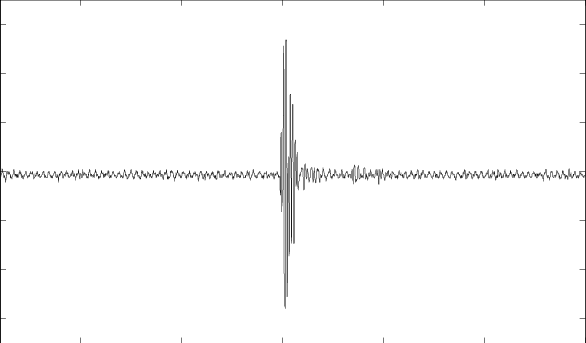
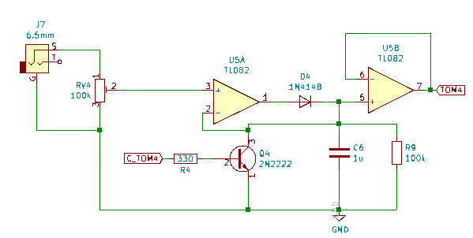
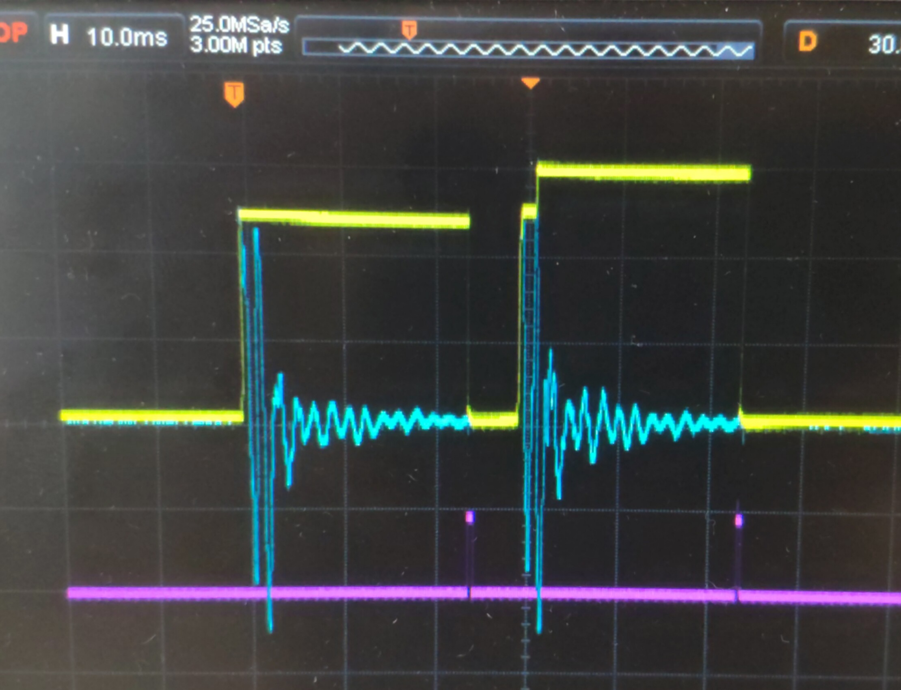

# Low-Cost MIDI Drum Trigger Interface

Many people may not know this, but drums are expensive, and if you live in an apartment, you can't just buy a cheap acoustic set and play, as your neighbors will call the police before you can finish playing your first song because an acoustic set can easily reach +110 dB.

However, there is another option, electronic drums. They are so silent that your roommates won't even complain (if you play at 3AM they might). But there is one **big** drawback to edrums, they are **too expensive**.

A low-tier edrum can go around 400€, I currently own a Yamaha DTX450k and I got a deal for it at 440€, as it normally goes for 550€ and when I was staring to practice it was OK, but then I got the chance to practice for a year on a acoustic set, and when I had to return to my cheap set I started to 

Here are some problems that you may encounter when you play a cheap electronic set:
- The sounds from the module are awful, specially the cymbals.
- The pads are tiny and hard, in my Yamaha Drumset, they are 8 inches wide.
- All the pads and cymbals are single-zone, so no rimshot, bell sound or anything else.
- Hihat pedal is only in open or closed position, you can't get a lot of sounds from it.
- In my case, as I like to play hard, the drum rack was moving a lot. The snare is always falling.

Sure, all of these problems may disappear as you upgrade to a more expensive drum set, but you will have to spend around 1200€. But even then, it will still be a mid-tier electronic drumset.

The best option, in my opinion, is to convert an acoustic set into an electronic one. If you already have an acoustic set or if you don't have one, as you can get one for 100€ or 200€. Now, there are two options for electronic conversion, buy the triggers and cymbals or go the DIY route, which is **much cheaper**. Although there is one expensive component that all the DIY guides asks for, the **Drum Module**.

It is normally the most expensive component in every drumset. The job of this component is critical, read the signals from the triggers and make a sound accordingly. Drum modules can go for around 300€ to 700€, but instead of buying a module that produce a mediocre sound, you should buy or make a trigger interface, is the same a drum module but instead of producing the sounds by itself, it sends MIDI notes to your computer, which will always produce better sound than even the most expensive modules.

Trigger Interfaces are much cheaper, the DDrum Trigger Interface will work perfectly for only 170€, but you can even make this component yourself.

**DISCLAIMER**: From now on, the guide will center on build the interface, in the following months a guide on DIY trigger and cymbals will be available. But from now, there is plenty of information online.

# How it works?

There are many Arduino drum modules online, but a common problem in all of them is the latency, I find that an Arduino isn't fast enough to process the raw piezo signal from several channels, which is the approach that many people follow when making the interface. 

As seen in the picture, the peak of a piezo may only occur in the span of 100us. So the microcontroller may not read the channel at just the peak, so it will send no MIDI value at all, or send a wrong value. That is why in my desing I decided to add a **peak detector circuit** per channel.

This circuit maintains the highest voltage from the piezo, so the voltage of the peak will be available for the uC to be read. Once the peak value has been registered, the capacitor will be discharged through the transistor, reseting the peak detector.

- **Yellow Signal**: Raw piezo signal.
- **Blue Signal**: Peak detector output.
- **Pink Signal**: Transistor gate.

Once the uC detects a value on the channels higher than a given **threshold**, it wait a couple of milliseconds for the signal to reach the peak, this period is called **scan time**, after that, the value of the channel is read. But to stop retriggering, the uC won't clear the detector once a **dead time** has finished. All of these values are standarts from drum modules, and they can be set from channel to channel. 

This desing is centered arround the AtMega 2560, as I want more than 6 channels for a full electronic set. But the list of mat
